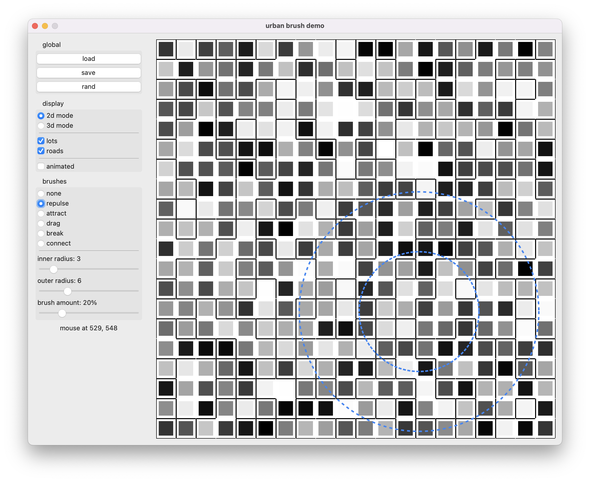
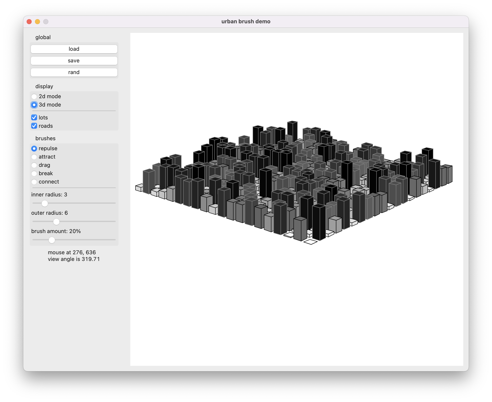

# Urban Brush demo

This is an unofficial demo of the original paper [Urban Brush: Intuitive and Controllable Urban Layout Editing](https://dl.acm.org/doi/abs/10.1145/3472749.3474787).

## 1. prerequisites

> the original version of Tkinter of MAC OS does not work

- Python3.8
- Tkinter
- Pickle
- Numpy

## 2. how to run

```shell
python3 main.py
```

## 3. details

### 3.1 load, save and randomize

- Users may generate a random layout by clicking the "rand" button.
- If there is an existing layout file (*.ub), users may load it back by clicking the "load" button
- After editing the current layout, users may save it to the device by clicking the "save" button.

## 3.2 preview mode

- Users may preview the layout in both 2D mode and 3D mode by switching between the corresponding radio buttons.
- However, operations are only permitted under 3D mode.

### 3.2.1 2d preview mode

- Users may choose to hide lots or roads in the 2d preview mode by checking the corresponding checkboxes.



### 3.2.2 3d preview mode

- Users may change the angle of view by intuitively dragging canvas with the mouse left button.
- The canvas is rendered with perspective projection.



## 3.3 brushes

I implemented 5 brushes in the demo and made some simplifications.

### 3.3.1 brush types

- [ ] reconfigure: revise the base terrain
- [ ] shrink, expand: resize the whole city
- [x] repulse: repulse populations and jobs away from the center
- [x] attract: attract populations and jobs towards the center
- [x] drag: drag populations and jobs from one region and drop them in another region
- [x] break: break roads
- [x] connect: connect roads
- [ ] mask: mask lots from getting revised

### 3.3.2 brush attributes

- inner region (AKA impact region) radius changeable
- outer region (AKA influence region) radius changeable
- the amount of each operation changeable

### 3.3.3 simplifications

- the city layout is expressed by a 2d matrix
- the terrain is simply a plain (no mountains and rivers)
- every lot takes up exactly one square unit
- every lot only holds population as its attributes (job removed)
- ...
